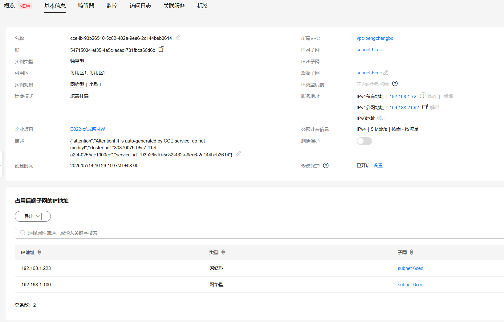

## install
### 安装kruise
--set featureGates="PodProbeMarkerGate=true"  
```bash
helm upgrade \
--install kruise openkruise/kruise \
--set manager.image.repository=swr.cn-southwest-2.myhuaweicloud.com/mabing/kruise-game-manager:v0.10.0-debug \
--set featureGates="PodProbeMarkerGate=true"
```
### 安装kruise-game
chart的源代码在`https://github.com/openkruise/charts/blob/master/charts/kruise-game`
```bash
helm install kruise-game openkruise/kruise-game --version 0.10.0 \
--set image.repository=10.6.178.178:5000/kruise-game-manager
```
安装后的资源  
- 在`kruise-game-system`里有一个ConfigMap  
- 有webhook

#### 安装实例(例子)
```bash
cat <<EOF | kubectl apply -f -
apiVersion: game.kruise.io/v1alpha1
kind: GameServerSet
metadata:
  name: minecraft
  namespace: kruise-game-system
spec:
  replicas: 3
  updateStrategy:
    rollingUpdate:
      podUpdatePolicy: InPlaceIfPossible
  gameServerTemplate:
    spec:
      containers:
        - image: registry.cn-hangzhou.aliyuncs.com/acs/minecraft-demo:1.12.2
          name: minecraft
          env:
          - name: GS_NAME
            valueFrom:
              fieldRef:
                fieldPath: metadata.name
EOF
```
只包含两个CRD对象：GameServerSet(gss)与GameServer(gs)    
```text
root in 󱃾 a223(kruise-game-system) ~ via  v24.1.0
➜ k get gss
NAME        DESIRED   CURRENT   UPDATED   READY   MAINTAINING   WAITTOBEDELETED   AGE
minecraft   3         3         3         3       0             0                 5m23s

root in 󱃾 a223(kruise-game-system) ~ via  v24.1.0
➜ k get gs
NAME          STATE   OPSSTATE   DP    UP    AGE
minecraft-0   Ready   None       0     0     81s
minecraft-1   Ready   None       0     0     114s
minecraft-2   Ready   None       0     0     2m27s

root in 󱃾 a223(kruise-game-system) ~ via  v24.1.0
➜ k get statefulsets.apps.kruise.io # k get asts
NAME        DESIRED   CURRENT   UPDATED   READY   AGE
minecraft   3         3         3         3       5m37s

root in 󱃾 a223(kruise-game-system) ~ via  v24.1.0
➜ k get po
NAME                                              READY   STATUS    RESTARTS   AGE
kruise-game-controller-manager-747b779b47-gvhtx   1/1     Running   0          24h
minecraft-0                                       1/1     Running   0          94s
minecraft-1                                       1/1     Running   0          2m7s
minecraft-2                                       1/1     Running   0          2m40s

root in 󱃾 cce(kruise-game-system) ~/daocloud
➜ k delete gss minecraft
gameserverset.game.kruise.io "minecraft" deleted
```
#### 安装无头服务
通过无头服务访问对应的pod  
```bash
cat <<EOF | kubectl apply -f -
apiVersion: v1
kind: Service
metadata:
    name: minecraft
    namespace: kruise-game-system
spec:
  clusterIP: None # 设置为 None 使得服务成为 Headless
  selector:
    game.kruise.io/owner-gss: minecraft # 填写GameServerSet的名称

---
apiVersion: game.kruise.io/v1alpha1
kind: GameServerSet
metadata:
  name: accessor
  namespace: default
spec:
  replicas: 1
  gameServerTemplate:
    spec:
      containers:
        - image: release-ci.daocloud.io/demo/busybox:latest
          name: accessor
          args:
            - sleep
            - "3600"
          command: ["/bin/sh", "-c", "sleep 3600"]
EOF
OKG 支持以 "gs-sync/" 开头的 label/annotation 从 GameServer 同步到 Pod 之上，如下所示：
kubectl patch gs minecraft-0 --type='merge'  -p  '{"metadata":{"annotations":{"gs-sync/test-key":"some-value"}}}'
gameserver.game.kruise.io/minecraft-0 patched
```

## 如何打包镜像
build-image.sh

## 如何本地运行程序
把k8s集群里的deploy的replicas设置为0,在本地运行程序
```bash
export KUBECONFIG=/root/.kube/configs/config.cce.yaml
go run main.go \
--leader-elect=false \
--provider-config=/root/huawei/openkruise/kruise-game/config/manager/config.toml
```
但是k8s服务器里的webhook依然在, 创建/更新的时候会有问题  
- 移除远端的webhook?
- 远端的deploy的replicas不设置为0, 仅仅是注释掉reconcil的部分,保留webhook的部分

### 使用ktctl
- 8080:8080, 第一个是本地的,需要先在本地启动main.go, 第二个是远端的TargetPort,不是get svc看到的port  
  ```
    ktctl -c /root/.kube/configs/config.cce.yaml -n kruise-game-system exchange kruise-game-controller-manager-metrics-service --expose 8080:8080
    
    ktctl -c /root/.kube/configs/config.cce.yaml -n kruise-game-system exchange kruise-game-external-scaler  --expose 6000:6000
    
    ktctl -c /root/.kube/configs/config.cce.yaml -n kruise-game-system exchange kruise-game-webhook-service   --expose 9876:9876
  ```
#### 错误一
`kruise-game-controller-manager-metrics-service`的`targetPort`是字符串`https`,需要到pod里去查看, 如果你把pod所在的Deployment的replicas scale到0,那么
ktctl会报找不到这个端口, 你可以在本地让ktctl起来后,再scale 到 0.  

#### 错误二
```text
root in 󱃾 cce(kruise-game-system) mine/huawei/examples on  notes [✘!?] 
❯ k apply -f elb-union.yaml
Error from server (InternalError): error when creating "elb-union.yaml": Internal error occurred: failed calling webhook "kruise-game-webhook-service.kruise-game-system.svc": failed to call webhook: Post "https://kruise-game-webhook-service.kruise-game-system.svc:443/validate-v1alpha1-gss?timeout=10s": tls: failed to verify certificate: x509: certificate signed by unknown authority (possibly because of "crypto/rsa: verification error" while trying to verify candidate authority certificate "webhook-cert-ca")
```
应该是你在本地正确启动ktctl之前就启动了应用程序, 导致webhook验证失败  

## 与openkruise的关联在哪里?
调了api: `github.com/openkruise/kruise-api`

## 云厂商的接入
- 代码位置: cloudprovider[cloudprovider](../cloudprovider)
  - [alibabacloud](../cloudprovider/alibabacloud): 阿里云
  - [amazonswebservices](../cloudprovider/amazonswebservices): aws
  - [hwcloud](../cloudprovider/hwcloud): 华为云
  - [jdcloud](../cloudprovider/jdcloud): 京东云
  - [kubernetes](../cloudprovider/kubernetes): k8s原生
  - [manager](../cloudprovider/manager):
  - 
  - [options](../cloudprovider/options): 配置选项
  - [volcengine](../cloudprovider/volcengine): 火山云
  - [tencentcloud](../cloudprovider/tencentcloud): 腾讯云
- 华为已经有代码了(cloudprovider/hwcloud),为什么还要求接入? 
- 各个云厂商的文档: https://openkruise.io/zh/kruisegame/user-manuals/network

### 阿里云的SLB/NLB
https://developer.aliyun.com/article/1048503

### 做的最好的
- `cloudprovider/amazonswebservices`: 有一个单独的controller,比较接近华为的要求, 其他厂商貌似在自己家的k8s里已经内置了相关的支持,直接打annotation/label即可.  
- 阿里是项目的发起者, 大概跟华为云的逻辑更接近

## 疑问
为什么`kruise-game-system`里的ConfigMap,没有华为云的配置  
应该是`versions/kruise-game/0.10/templates/controller_manager_config.yaml`这里没写
```yaml
apiVersion: v1
data:
  config.toml: |
    [kubernetes]
    enable = true
    [kubernetes.hostPort]
    max_port = 9000
    min_port = 8000

    [alibabacloud]
    enable = true
    [alibabacloud.slb]
    max_port = 700
    min_port = 500
    block_ports = [593]
    [alibabacloud.nlb]
    max_port = 1502
    min_port = 1000
    block_ports = [1025, 1434, 1068]

    [volcengine]
    enable = true
    [volcengine.clb]
    max_port = 600
    min_port = 550
    block_ports = [593]

    [aws]
    enable = false
    [aws.nlb]
    max_port = 30050
    min_port = 30001

    [jdcloud]
    enable = false
    [jdcloud.nlb]
    max_port = 700
    min_port = 500

    [tencentcloud]
    enable = true
    [tencentcloud.clb]
    min_port = 700
    max_port = 750
  controller_manager_config.yaml: |
    apiVersion: controller-runtime.sigs.k8s.io/v1alpha1
    kind: ControllerManagerConfig
    health:
      healthProbeBindAddress: :8081
    metrics:
      bindAddress: 127.0.0.1:8080
    webhook:
      port: 9443
    leaderElection:
      leaderElect: true
      resourceName: c637bb1e.my.domain
kind: ConfigMap
metadata:
  annotations:
    meta.helm.sh/release-name: kruise-game
    meta.helm.sh/release-namespace: kruise-system
  creationTimestamp: "2025-06-30T09:42:16Z"
  labels:
    app.kubernetes.io/managed-by: Helm
  name: kruise-game-manager-config
  namespace: kruise-game-system
  resourceVersion: "357781984"
  uid: cb47c908-9af9-432f-a036-3495a44f8171
```
这个cm里的min_port,max_port起什么作用?
## 华为的任务
- 任务需求
    * ELB 适配开发
        * 通过CRD或者Annotation 实现ELB资源的动态创建/配置/删除。 
        * 实现 ELB 资源复用机制：支持多个 Service 共享同一 ELB 实例的不同端口，并配置端口分配策略。 
        * 支持固定 IP（Fixed IP）绑定功能，确保服务重启时 ELB IP 不变。 
        * 提供网络隔离能力（如安全组规则自动配置），确保不同 GameServer 间的网络流量隔离。 
    * EIP 适配开发 
      * 自动为GameServer分配EIP，并关联到指定节点或Pod。 
      * 实现 EIP 生命周期管理：随 GameServer 创建/销毁自动关联/解绑 EIP，避免资源泄漏。 
    * 功能测试与验证 
      * 编写单元测试用例，覆盖 ELB/EIP 适配逻辑的核心功能（如端口分配、EIP 绑定）。 
      * 在华为云 CCE 集群中部署 OKG，完成集成测试，验证以下场景： 
        * ELB 多 Service 端口复用与固定 IP 功能。 
        * GameServer 动态 EIP 分配与自动回收。 
        * 网络隔离策略生效性验证。

CCE网络模型参考：
CCE的ELB直通pod功能
- https://support.huaweicloud.com/usermanual-cce/cce_10_0681.html
CCE的Pod绑定EIP功能
- https://support.huaweicloud.com/usermanual-cce/cce_10_0734.html

### CCE
https://support.huaweicloud.com/cce/index.html  
云容器引擎（Cloud Container Engine，简称CCE）提供高度可扩展的、高性能的企业级Kubernetes集群。借助云容器引擎，您可以在华为云上轻松部署、管理和扩展容器化应用程序。  
- CCE的几种类型: https://support.huaweicloud.com/usermanual-cce/cce_10_0342.html, Standard, Trubo, Autopilot

### ELB和EIP的SDK/API
- ELB
  - 文档: https://support.huaweicloud.com/sdkreference-elb/elb_sdk_01.html  
  - 文档: https://github.com/huaweicloud/huaweicloud-sdk-go-v3   
  - 示例代码: https://support.developer.huaweicloud.com/doc/development/Network-capability-samples-code/codelabs-ELB
- EIP
  - 文档: https://support.huaweicloud.com/sdkreference-eip/eip_sdk_0001.html
  - 文档: https://github.com/huaweicloud/huaweicloud-sdk-go-v3
  - 示例代码: https://support.developer.huaweicloud.com/doc/development/Network-capability-samples-code/codelabs-EIP

## 开发中遇到的问题
### FailedScheduling
```
4m31s       Warning   FailedScheduling        pod/minecraft-2                                     0/1 nodes are available: 1 Too many pods. preemption: 0/1 nodes are available: 1 No preemption victims found for incoming pod.
9m47s       Warning   Unschedulable           gameserver/minecraft-2                              0/1 nodes are available: 1 Too many pods. preemption: 0/1 nodes are available: 1 No preemption victims found for incoming pod.
```
是什么导致的无法调度呢? 把pod缩小为3个就ok了

### webhook 拒绝
使用example.yaml里的第二个yaml创建  
在本地启动的服务报:  
```
E0708 16:34:06.926218  193271 gameserver_manager.go:231] failed to patch Pod gs-natgw-0 in kruise-game-system,because of admission webhook "kruise-game-webhook-service.kruise-game-system.svc" denied the request: services "gs-natgw-0" is forbidden: loadBalancerID[elb-306e] is invalid.
```
是因为ELB的id用错了  
elb-306e: 是ELB的名字  
  
这个loadBalancerID[elb-306e] is invalid应该是华为CCE报的错误  


### 没有找到插件
应该是controller-manager里没有相关的插件
```bash
root in 󱃾 cce(kruise-game-system) ~ via  v24.1.0
➜ k apply -f /tmp/hw-example.yaml
Error from server (Forbidden): error when creating "/tmp/hw-example.yaml": admission webhook "kruise-game-webhook-service.kruise-game-system.svc" denied the request: network type must be one of [Kubernetes-HostPort Kubernetes-Ingress Kubernetes-NodePort AlibabaCloud-EIP AlibabaCloud-Multi-NLBs AlibabaCloud-NATGW AlibabaCloud-NLB AlibabaCloud-NLB-SharedPort AlibabaCloud-SLB AlibabaCloud-SLB-SharedPort AlibabaCloud-AutoNLBs Volcengine-CLB Volcengine-EIP TencentCloud-CLB]
```

### 服务的端口
OKG里华为ELB的代码生成的service没有端口,导致失败...那么阿里是怎么做的,阿里的例子里没有指定这个端口号怎么对应啊

## TODO
https://github.com/openkruise/kruise-game/blob/master/docs/%E4%B8%AD%E6%96%87/%E7%94%A8%E6%88%B7%E6%89%8B%E5%86%8C/%E7%BD%91%E7%BB%9C%E6%A8%A1%E5%9E%8B.md, 
这个文档需的`当前支持的网络插件`要添加华为的ELB/EIP的信息, 应该还有个对应的英文文档也需要添加  

docs/中文/用户手册/网络模型.md 里有HwCloud-ELB的介绍,但是`spec.network.networkConf[0].name`写的是`ClbIds`, 应该是`ElbIds` -- 已修改  


支持多个ELB?  
用逗号分割, 是不是之间抄的阿里的, 所以也直接超过来了?  

### kubernetes.io/elb.x-forwarded-host
https://github.com/openkruise/kruise-game/blob/master/docs/%E4%B8%AD%E6%96%87/%E7%94%A8%E6%88%B7%E6%89%8B%E5%86%8C/%E7%BD%91%E7%BB%9C%E6%A8%A1%E5%9E%8B.md#%E7%A4%BA%E4%BE%8B%E8%AF%B4%E6%98%8E-5  
用这个例子, 会报这个错误: 
```
2025-07-09T14:57:48+08:00	ERROR	Reconciler error	{"controller": "gameserver-controller", "object": {"name":"gs-natgw-0","namespace":"kruise-game-system"}, "namespace": "kruise-game-system", "name": "gs-natgw-0", "reconcileID": "697cca4a-6650-4052-a58a-fab9a4203161", "error": "admission webhook \"kruise-game-webhook-service.kruise-game-system.svc\" denied the request: admission webhook \"validate.crd.service\" denied the request: only performance elb supports kubernetes.io/elb.x-forwarded-host"}
```

## parseLbConfig
返回的错误会被一直reconcile, 删gss/pod也删除不掉   

## kubernetes.io/elb.class
`kubernetes.io/elb.class`设置为union没有办法访问, `status.loadBalancer.ingress`没有第二个ip, 但是多出一个`kubernetes.io/elb.eip-id`的annotation,参见example-svc-output.yaml      
这个好像又不是问题   
```text
status:
  loadBalancer:
    ingress:
    - ip: 192.168.0.147
    - ip: 189.1.225.136
```

## 每个pod都对应一个svc
```bash
root in 󱃾 cce(kruise-game-system) kruise-game-notes/mine on  notes [✘!?] 
➜ k get po|grep gs-elb
gs-elb-performance-0                                               1/1     Running   0          23m
gs-elb-performance-1                                               1/1     Running   0          23m

root in 󱃾 cce(kruise-game-system) kruise-game-notes/mine on  notes [✘!?] 
➜ k get svc|grep gs-elb
gs-elb-performance-0                             LoadBalancer   10.247.118.203   189.1.225.136,192.168.0.147   507:31157/TCP   2m2s
gs-elb-performance-1                             LoadBalancer   10.247.121.247   189.1.225.136,192.168.0.147   509:30684/TCP   2m6s
```

## CCE Turbo集群每个节点的pod数受网卡限制
CCE Turbo集群中，节点最大实例数由节点可使用的网卡数量决定。  
https://support.huaweicloud.com/productdesc-cce/cce_productdesc_0005.html#section4  
一个新加的节点啥都没干, 6个pod没了  

```bash
root in 󱃾 cce(kruise-game-system) ~/daocloud took 2s
➜ k get po -owide -A|grep '192.168.1.87'
default              node-shell-8kf28                                                   1/1     Running   0               4m14s   192.168.1.35    192.168.1.87    <none>           <none>
kruise-system        kruise-daemon-mnpmk                                                1/1     Running   0               4m14s   192.168.1.87    192.168.1.87    <none>           <none>
kube-system          coredns-599b56fc64-hzb75                                           1/1     Running   0               6d23h   192.168.1.129   192.168.1.87    <none>           <none>
kube-system          everest-csi-controller-67d96445fc-wt9gb                            1/1     Running   0               7d      192.168.1.173   192.168.1.87    <none>           <none>
kube-system          everest-csi-driver-n8ttd                                           1/1     Running   0               4m14s   192.168.1.87    192.168.1.87    <none>           <none>
kube-system          icagent-56vmj                                                      1/1     Running   0               4m14s   192.168.1.87    192.168.1.87    <none>           <none>
```

## Pending错误
直接k describe svc xxx  
```
Events:
  Type     Reason                    Age                  From                Message
  ----     ------                    ----                 ----                -------
  Normal   LoadbalancerIP            3m                   service-controller  -> 192.168.0.147
  Normal   EnsuringLoadBalancer      34s (x6 over 3m)     service-controller  Ensuring load balancer
  Warning  CreateLoadBalancerFailed  34s (x6 over 3m)     hws-cloudprovider   Details: Create loadbalancer(192.168.0.147) error: session affinity type:off not support
  Warning  UpdateLoadBalancerFailed  34s (x6 over 3m)     hws-cloudprovider   Details: Update loadbalancer(192.168.0.147) error: session affinity type:off not support
  Warning  SyncLoadBalancerFailed    34s (x6 over 3m)     service-controller  Error syncing load balancer: failed to ensure load balancer: session affinity type:off not support
  Warning  UpdateLoadBalancerFailed  21s (x2 over 2m59s)  hws-cloudprovider   error update loadBalancer
```

union错误:  
```text
 Warning  UpdateLoadBalancerFailed  11s (x4 over 25s)  hws-cloudprovider   Details: Update member of listener/pool(53e79f61-253b-4e90-b98e-f61d12fee25f/e6aab5d6-3984-4bcf-83ba-6a54b44aba26) error: Failed to create member : {"error":{"message":"Vpc aacb184e-ba7e-4046-bb33-ccac42c30164 of member's subnet_cidr 8459a9bc-180d-403e-a622-d489e74c7c5b and vpc 427d9606-bfae-4508-95ea-9ff4e6804478 of loadbalancer debd5c46-9ce5-44fc-ba07-4e911ad1ae36 mismatch","code":"ELB.9899"}}, status code: 400
```

## NetworkNotReady
Golang代码里需要这一句,不然gs状态一直不能更改  
svcAnnotations[ElbConfigHashKey] = util.GetHash(sc)  

## CCE的vpc需要和ELB的vpc一致
不然在CCE里用annotation绑定ELB会失败

## 共享ELB用annotation绑定svc
EXTERNAL IP没有使用ELB的公网IP,而是使用ELB的内网IP  
ELB的id填错了,填成独占ELB的id了, 或者这个ELB id压根就不存在  

## EIP
### 对标阿里的哪个产品
EIP

### ELB没有svc(svc没有创建出来)
只是在pod上体现
```
I0717 16:13:58.232782 2438837 gameserverset_manager.go:110] GameServerSet kruise-game-system/gs-elb-performance-2 will kill 0 GameServers
I0717 16:13:59.392975 2438837 gameserverset_manager.go:110] GameServerSet kruise-game-system/gs-elb-performance-2 will kill 0 GameServers
I0717 16:14:02.220023 2438837 gameserver_manager.go:317] GameServer kruise-game-system/gs-elb-performance-2-0 DesiredNetworkState: Ready CurrentNetworkState: . 56.77998548s remaining
```
莫名其妙的没有第二次触发`func (s *ElbPlugin) OnPodUpdated`, `gameserver_manager.go:317`这里的代码问题?  
https://github.com/openkruise/kruise-game/blob/1e495b94fb93d65311994f65a88dd178fa7aa038/pkg/controllers/gameserver/gameserver_controller.go#L277 这里没有触发`func (s *ElbPlugin) OnPodUpdated`  
解决办法: 更改pod的`lifecycle.apps.kruise.io/timestamp`这个annotation  

## 填写bool类型为true报错
改为"true"
```text
The GameServerSet "gs-elb-performance" is invalid: spec.network.networkConf[3].value: Invalid value: "boolean": spec.network.networkConf[3].value in body must be of type string: "boolean"
```
## 在gss上添加了annotation后
最终反应到了svc上, 符合预期

## 每个pod对应一个servcie
每个service都可以通过公网访问, 符合预期

## fixed ip和网络隔离
https://github.com/openkruise/kruise-game/issues/20  

## autocreate的时候报错
```text
2025-07-11T17:07:23+08:00	ERROR	Reconciler error	{"controller": "gameserver-controller", "object": {"name":"gs-elb-auto-performance-0","namespace":"kruise-game-system"}, "namespace": "kruise-game-system", "name": "gs-elb-auto-performance-0", "reconcileID": "ada3c25a-3d78-409c-935c-b5d65b2fbe84", "error": "admission webhook \"kruise-game-webhook-service.kruise-game-system.svc\" denied the request: there are no avaialable ports for []"}
```

## newCache/newPodAllocate的数据结构
在初始化插件和每次创建pod和删除pod的时候都会更新newPodAllocate,newCache
### cache
一个map  
key: elb的Id  
value: map[int32]bool, int32是端口, bool表示是否被占用, false表示没有被占用, true表示被占用blockPorts始终是true  
### podAllocate
一个map  
key: 命名空间/svc名字(pod名字, 因为2者是一样的)  
value: string, "elb的Id:已经使用的端口号1,已经使用的端口号2,"
```text
I0712 17:28:45.522083  159454 elb.go:102] [HwCloud-ELB] podAllocate cache complete initialization: map[kruise-game-system/gs-elb-performance-0:8f4cf216-a659-40dc-8c77-6068b036ba56:594 kruise-game-system/gs-elb-performance-1:8f4cf216-a659-40dc-8c77-6068b036ba56:517 kruise-game-system/gs-elb-union-0:c1d8f4c6-7aef-4596-8c7c-2de87ff89545:675 kruise-game-system/gs-elb-union-1:c1d8f4c6-7aef-4596-8c7c-2de87ff89545:639]

```
## 如何获取当前账号的可用地区
available_zone  
可以在elb的列表页面F12查看返回获取  

## auto create elb
原始文件: `mine/huawei/examples/svc-elb-autocreate.yaml`  
会自动添加如下annotations  
```text
    kubernetes.io/elb.eip-id: d1779912-0f38-49f4-ab3e-24b7dfe8c114
    kubernetes.io/elb.enterpriseID: aff97261-4dbd-4593-8236-d7a5daf6a943
    kubernetes.io/elb.id: 2c64205c-4169-42f9-918f-66854bbc3f08
```

如果是独占型的, 删除这个svc后, 会自动删除ELB和EIP       
如果是union类型的，删除了所有svc, 会自动删除ELB和EIP    

## there are no avaliable ports for []
文件： gss-elb-performance-autocreate.yaml  
在 `case ElbAutocreateAnnotationKey`没有加到hwOption里
```text
2025-07-14T11:42:59+08:00	ERROR	Reconciler error	{"controller": "gameserver-controller", "object": {"name":"gs-elb-auto-performance-1","namespace":"kruise-game-system"}, "namespace": "kruise-game-system", "name": "gs-elb-auto-performance-1", "reconcileID": "126d1aaa-fa6e-446e-ba90-7c369926c246", "error": "admission webhook \"kruise-game-webhook-service.kruise-game-system.svc\" denied the request: there are no avaliable ports for []"}

```

## 固定eip
是否开启Pod固定EIP，只有StatefulSet类型的Pod或`无ownerReferences`的Pod支持，默认不开启。  
https://support.huaweicloud.com/usermanual-cce/cce_10_0651.html#section2

## 测试指定package/文件的ut覆盖率
进入这个package的目录   
```
root in kruise-game/cloudprovider/hwcloud on  simplize-huawei-elb [!] via 🐹 v1.23.3 
➜ go test -coverprofile=coverage.out .
ok      github.com/openkruise/kruise-game/cloudprovider/hwcloud 0.022s  coverage: 38.0% of statements

root in kruise-game/cloudprovider/hwcloud on  simplize-huawei-elb [!] via 🐹 v1.23.3 took 26s 
➜ pwd
/root/huawei/openkruise/kruise-game/cloudprovider/hwcloud

# 生成可读性更高的html报告
root in kruise-game/cloudprovider/hwcloud on  simplize-huawei-elb via 🐹 v1.23.3 took 2s 
➜ go tool cover -html=coverage.out -o coverage.html

```

## elb.connection-drain-enable
如果指定了`kubernetes.io/elb.connection-drain-enable`, 就必须指定`kubernetes.io/elb.connection-drain-timeout`
```
Warning  CreateLoadBalancerFailed  30s                hws-cloudprovider   Details: Create pool of listener(bdefe366-d4e4-41ce-bd54-794d3a6f6456) error: failed to create pool : {"error_msg":"Connection drain timeout must be explict defined.","error_code":"ELB.8902","request_id":"7cf9da9b3993340ba966659a2d272e3c"}, status code: 400
```