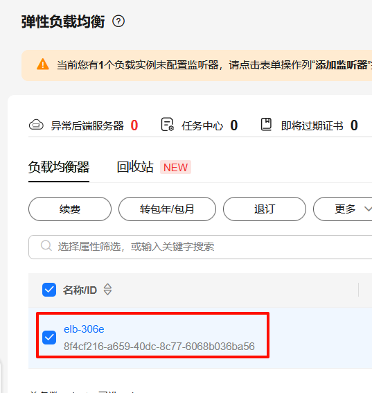

## install
### 安装kruise
--set featureGates="PodProbeMarkerGate=true"  
```bash
helm upgrade \
--install kruise openkruise/kruise \
--set manager.image.repository=swr.cn-southwest-2.myhuaweicloud.com/mabing/kruise-game-manager:v0.10.0-debug \
--set featureGates="PodProbeMarkerGate=true"
```
### 安装kruise-game
chart的源代码在`https://github.com/openkruise/charts/blob/master/charts/kruise-game`
```bash
helm install kruise-game openkruise/kruise-game --version 0.10.0 \
--set image.repository=10.6.178.178:5000/kruise-game-manager
```
安装后的资源  
- 在`kruise-game-system`里有一个ConfigMap  
- 有webhook

#### 安装实例(例子)
```bash
cat <<EOF | kubectl apply -f -
apiVersion: game.kruise.io/v1alpha1
kind: GameServerSet
metadata:
  name: minecraft
  namespace: kruise-game-system
spec:
  replicas: 3
  updateStrategy:
    rollingUpdate:
      podUpdatePolicy: InPlaceIfPossible
  gameServerTemplate:
    spec:
      containers:
        - image: registry.cn-hangzhou.aliyuncs.com/acs/minecraft-demo:1.12.2
          name: minecraft
          env:
          - name: GS_NAME
            valueFrom:
              fieldRef:
                fieldPath: metadata.name
EOF
```
只包含两个CRD对象：GameServerSet(gss)与GameServer(gs)    
```text
root in 󱃾 a223(kruise-game-system) ~ via  v24.1.0
➜ k get gss
NAME        DESIRED   CURRENT   UPDATED   READY   MAINTAINING   WAITTOBEDELETED   AGE
minecraft   3         3         3         3       0             0                 5m23s

root in 󱃾 a223(kruise-game-system) ~ via  v24.1.0
➜ k get gs
NAME          STATE   OPSSTATE   DP    UP    AGE
minecraft-0   Ready   None       0     0     81s
minecraft-1   Ready   None       0     0     114s
minecraft-2   Ready   None       0     0     2m27s

root in 󱃾 a223(kruise-game-system) ~ via  v24.1.0
➜ k get statefulsets.apps.kruise.io # k get asts
NAME        DESIRED   CURRENT   UPDATED   READY   AGE
minecraft   3         3         3         3       5m37s

root in 󱃾 a223(kruise-game-system) ~ via  v24.1.0
➜ k get po
NAME                                              READY   STATUS    RESTARTS   AGE
kruise-game-controller-manager-747b779b47-gvhtx   1/1     Running   0          24h
minecraft-0                                       1/1     Running   0          94s
minecraft-1                                       1/1     Running   0          2m7s
minecraft-2                                       1/1     Running   0          2m40s

root in 󱃾 cce(kruise-game-system) ~/daocloud
➜ k delete gss minecraft
gameserverset.game.kruise.io "minecraft" deleted
```
#### 安装无头服务
通过无头服务访问对应的pod  
```bash
cat <<EOF | kubectl apply -f -
apiVersion: v1
kind: Service
metadata:
    name: minecraft
    namespace: kruise-game-system
spec:
  clusterIP: None # 设置为 None 使得服务成为 Headless
  selector:
    game.kruise.io/owner-gss: minecraft # 填写GameServerSet的名称

---
apiVersion: game.kruise.io/v1alpha1
kind: GameServerSet
metadata:
  name: accessor
  namespace: default
spec:
  replicas: 1
  gameServerTemplate:
    spec:
      containers:
        - image: release-ci.daocloud.io/demo/busybox:latest
          name: accessor
          args:
            - sleep
            - "3600"
          command: ["/bin/sh", "-c", "sleep 3600"]
EOF
OKG 支持以 "gs-sync/" 开头的 label/annotation 从 GameServer 同步到 Pod 之上，如下所示：
kubectl patch gs minecraft-0 --type='merge'  -p  '{"metadata":{"annotations":{"gs-sync/test-key":"some-value"}}}'
gameserver.game.kruise.io/minecraft-0 patched
```

## 如何打包镜像
build-image.sh

## 如何本地运行程序
把k8s集群里的deploy的replicas设置为0,在本地运行程序
```bash
export KUBECONFIG=/root/.kube/configs/config.cce.yaml
go run main.go \
--leader-elect=false \
--provider-config=/root/huawei/openkruise/kruise-game/config/manager/config.toml
```
但是k8s服务器里的webhook依然在, 创建/更新的时候会有问题  
- 移除远端的webhook?
- 远端的deploy的replicas不设置为0, 仅仅是注释掉reconcil的部分,保留webhook的部分

### 使用ktctl
- 8080:8080, 第一个是本地的,需要先在本地启动main.go, 第二个是远端的TargetPort,不是get svc看到的port  
  ```
  ktctl -c /root/.kube/configs/config.cce.yaml -n kruise-game-system exchange kruise-game-controller-manager-metrics-service --expose 8080:8080

  ktctl -c /root/.kube/configs/config.cce.yaml -n kruise-game-system exchange kruise-game-external-scaler  --expose 6000:6000

  ktctl -c /root/.kube/configs/config.cce.yaml -n kruise-game-system exchange kruise-game-webhook-service   --expose 9876:9876
  ```
- `kruise-game-controller-manager-metrics-service`的`targetPort`是字符串`https`,需要到pod里去查看, 如果你把pod所在的Deployment的replicas scale到0,那么
ktctl会报找不到这个端口, 你可以在本地让ktctl起来后,再scale 到 0.

## 与openkruise的关联在哪里?
调了api: `github.com/openkruise/kruise-api`

## 云厂商的接入
- 代码位置: cloudprovider[cloudprovider](../cloudprovider)
  - [alibabacloud](../cloudprovider/alibabacloud): 阿里云
  - [amazonswebservices](../cloudprovider/amazonswebservices): aws
  - [hwcloud](../cloudprovider/hwcloud): 华为云
  - [jdcloud](../cloudprovider/jdcloud): 京东云
  - [kubernetes](../cloudprovider/kubernetes): k8s原生
  - [manager](../cloudprovider/manager):
  - 
  - [options](../cloudprovider/options): 配置选项
  - [volcengine](../cloudprovider/volcengine): 火山云
  - [tencentcloud](../cloudprovider/tencentcloud): 腾讯云
- 华为已经有代码了(cloudprovider/hwcloud),为什么还要求接入? 
- 各个云厂商的文档: https://openkruise.io/zh/kruisegame/user-manuals/network

### 阿里云的SLB/NLB
https://developer.aliyun.com/article/1048503

### 做的最好的
- `cloudprovider/amazonswebservices`: 有一个单独的controller,比较接近华为的要求, 其他厂商貌似在自己家的k8s里已经内置了相关的支持,直接打annotation/label即可.  
- 阿里是项目的发起者, 大概跟华为云的逻辑更接近

## 疑问
为什么`kruise-game-system`里的ConfigMap,没有华为云的配置  
应该是`versions/kruise-game/0.10/templates/controller_manager_config.yaml`这里没写
```yaml
apiVersion: v1
data:
  config.toml: |
    [kubernetes]
    enable = true
    [kubernetes.hostPort]
    max_port = 9000
    min_port = 8000

    [alibabacloud]
    enable = true
    [alibabacloud.slb]
    max_port = 700
    min_port = 500
    block_ports = [593]
    [alibabacloud.nlb]
    max_port = 1502
    min_port = 1000
    block_ports = [1025, 1434, 1068]

    [volcengine]
    enable = true
    [volcengine.clb]
    max_port = 600
    min_port = 550
    block_ports = [593]

    [aws]
    enable = false
    [aws.nlb]
    max_port = 30050
    min_port = 30001

    [jdcloud]
    enable = false
    [jdcloud.nlb]
    max_port = 700
    min_port = 500

    [tencentcloud]
    enable = true
    [tencentcloud.clb]
    min_port = 700
    max_port = 750
  controller_manager_config.yaml: |
    apiVersion: controller-runtime.sigs.k8s.io/v1alpha1
    kind: ControllerManagerConfig
    health:
      healthProbeBindAddress: :8081
    metrics:
      bindAddress: 127.0.0.1:8080
    webhook:
      port: 9443
    leaderElection:
      leaderElect: true
      resourceName: c637bb1e.my.domain
kind: ConfigMap
metadata:
  annotations:
    meta.helm.sh/release-name: kruise-game
    meta.helm.sh/release-namespace: kruise-system
  creationTimestamp: "2025-06-30T09:42:16Z"
  labels:
    app.kubernetes.io/managed-by: Helm
  name: kruise-game-manager-config
  namespace: kruise-game-system
  resourceVersion: "357781984"
  uid: cb47c908-9af9-432f-a036-3495a44f8171
```
这个cm里的min_port,max_port起什么作用?
## 华为的任务
- 任务需求
    * ELB 适配开发
        * 通过CRD或者Annotation 实现ELB资源的动态创建/配置/删除。 
        * 实现 ELB 资源复用机制：支持多个 Service 共享同一 ELB 实例的不同端口，并配置端口分配策略。 
        * 支持固定 IP（Fixed IP）绑定功能，确保服务重启时 ELB IP 不变。 
        * 提供网络隔离能力（如安全组规则自动配置），确保不同 GameServer 间的网络流量隔离。 
    * EIP 适配开发 
      * 自动为GameServer分配EIP，并关联到指定节点或Pod。 
      * 实现 EIP 生命周期管理：随 GameServer 创建/销毁自动关联/解绑 EIP，避免资源泄漏。 
    * 功能测试与验证 
      * 编写单元测试用例，覆盖 ELB/EIP 适配逻辑的核心功能（如端口分配、EIP 绑定）。 
      * 在华为云 CCE 集群中部署 OKG，完成集成测试，验证以下场景： 
        * ELB 多 Service 端口复用与固定 IP 功能。 
        * GameServer 动态 EIP 分配与自动回收。 
        * 网络隔离策略生效性验证。

CCE网络模型参考：
CCE的ELB直通pod功能
- https://support.huaweicloud.com/usermanual-cce/cce_10_0681.html
CCE的Pod绑定EIP功能
- https://support.huaweicloud.com/usermanual-cce/cce_10_0734.html

### CCE
https://support.huaweicloud.com/cce/index.html  
云容器引擎（Cloud Container Engine，简称CCE）提供高度可扩展的、高性能的企业级Kubernetes集群。借助云容器引擎，您可以在华为云上轻松部署、管理和扩展容器化应用程序。  
- CCE的几种类型: https://support.huaweicloud.com/usermanual-cce/cce_10_0342.html, Standard, Trubo, Autopilot

### ELB和EIP的SDK/API
- ELB
  - 文档: https://support.huaweicloud.com/sdkreference-elb/elb_sdk_01.html  
  - 文档: https://github.com/huaweicloud/huaweicloud-sdk-go-v3   
  - 示例代码: https://support.developer.huaweicloud.com/doc/development/Network-capability-samples-code/codelabs-ELB
- EIP
  - 文档: https://support.huaweicloud.com/sdkreference-eip/eip_sdk_0001.html
  - 文档: https://github.com/huaweicloud/huaweicloud-sdk-go-v3
  - 示例代码: https://support.developer.huaweicloud.com/doc/development/Network-capability-samples-code/codelabs-EIP

## 开发中遇到的问题
### FailedScheduling
```
4m31s       Warning   FailedScheduling        pod/minecraft-2                                     0/1 nodes are available: 1 Too many pods. preemption: 0/1 nodes are available: 1 No preemption victims found for incoming pod.
9m47s       Warning   Unschedulable           gameserver/minecraft-2                              0/1 nodes are available: 1 Too many pods. preemption: 0/1 nodes are available: 1 No preemption victims found for incoming pod.
```
是什么导致的无法调度呢? 把pod缩小为3个就ok了

### webhook 拒绝
使用example.yaml里的第二个yaml创建  
在本地启动的服务报:  
```
E0708 16:34:06.926218  193271 gameserver_manager.go:231] failed to patch Pod gs-natgw-0 in kruise-game-system,because of admission webhook "kruise-game-webhook-service.kruise-game-system.svc" denied the request: services "gs-natgw-0" is forbidden: loadBalancerID[elb-306e] is invalid.
```
是因为ELB的id用错了  
elb-306e: 是ELB的名字  
  
这个loadBalancerID[elb-306e] is invalid应该是华为CCE报的错误  


### 没有找到插件
应该是controller-manager里没有相关的插件
```bash
root in 󱃾 cce(kruise-game-system) ~ via  v24.1.0
➜ k apply -f /tmp/hw-example.yaml
Error from server (Forbidden): error when creating "/tmp/hw-example.yaml": admission webhook "kruise-game-webhook-service.kruise-game-system.svc" denied the request: network type must be one of [Kubernetes-HostPort Kubernetes-Ingress Kubernetes-NodePort AlibabaCloud-EIP AlibabaCloud-Multi-NLBs AlibabaCloud-NATGW AlibabaCloud-NLB AlibabaCloud-NLB-SharedPort AlibabaCloud-SLB AlibabaCloud-SLB-SharedPort AlibabaCloud-AutoNLBs Volcengine-CLB Volcengine-EIP TencentCloud-CLB]
```

### 服务的端口
OKG里华为ELB的代码生成的service没有端口,导致失败...那么阿里是怎么做的,阿里的例子里没有指定这个端口号怎么对应啊

## TODO
https://github.com/openkruise/kruise-game/blob/master/docs/%E4%B8%AD%E6%96%87/%E7%94%A8%E6%88%B7%E6%89%8B%E5%86%8C/%E7%BD%91%E7%BB%9C%E6%A8%A1%E5%9E%8B.md, 
这个文档需的`当前支持的网络插件`要添加华为的ELB/EIP的信息, 应该还有个对应的英文文档也需要添加
